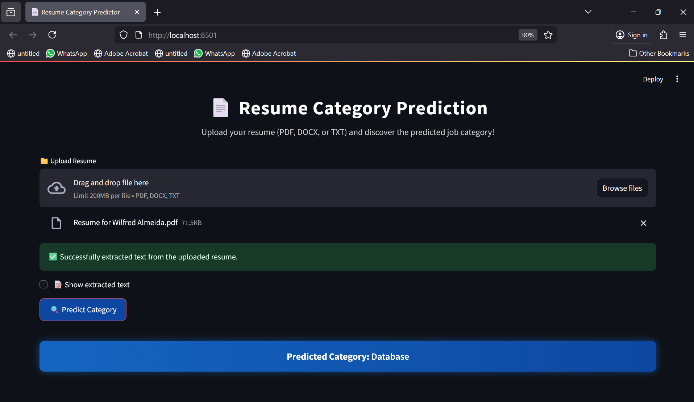
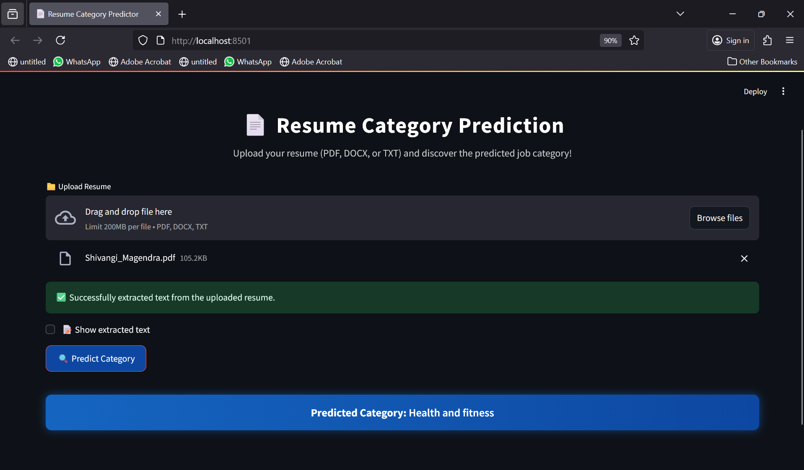
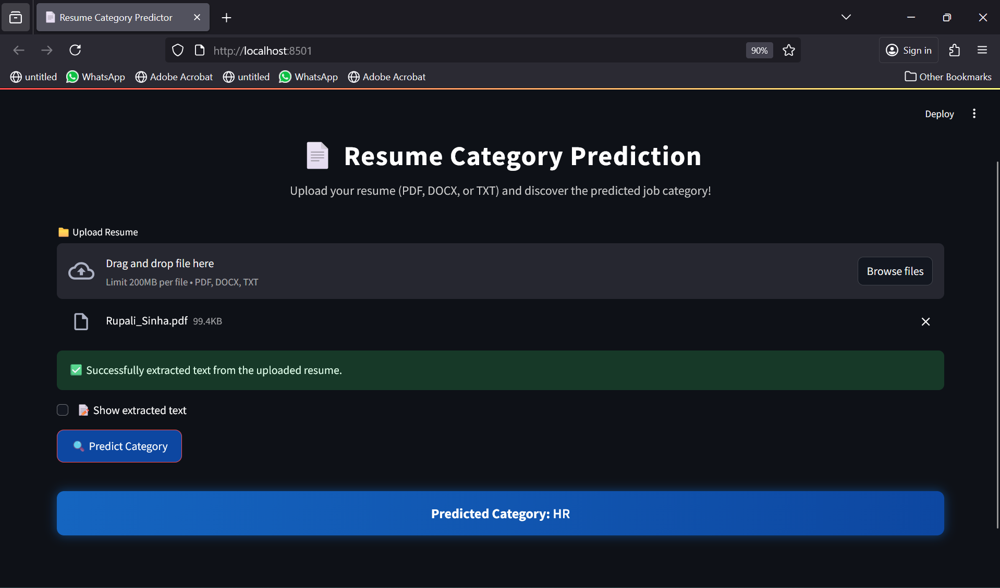

# 🤖 Resume Screening Application using KNN Classifier

  

## 📘 Overview

This project demonstrates the implementation of a **K-Nearest Neighbors (KNN)** Classifier — one of the most intuitive and powerful **supervised machine learning algorithms** used for both **classification and regression** tasks.  

The goal of this project is to **train, test, and evaluate** the KNN model using a given dataset and compare its performance with other popular classifiers such as:
- Support Vector Machine (SVM)
- Random Forest
- Logistic Regression
- Naive Bayes

---

## 🧠 About the Algorithm: KNN (K-Nearest Neighbors)

**KNN** is a **non-parametric**, **instance-based** learning algorithm. It works by finding the **K nearest data points** (neighbors) in the feature space and making predictions based on their majority class (for classification) or mean (for regression).

### 🔍 How it Works:
1. Choose the number of neighbors `K`.
2. Calculate the **distance** (commonly Euclidean) between the new data point and all other training samples.
3. Select the `K` nearest neighbors.
4. Perform **majority voting** — the class with the most votes among neighbors is assigned to the new point.

### ⚙️ Advantages:
- Simple and easy to understand.
- No assumptions about data distribution.
- Works well for small datasets.

### ⚠️ Limitations:
- Computationally expensive for large datasets.
- Sensitive to noisy data and irrelevant features.
- Requires feature scaling for accurate results.

## 📸 Screenshots  

  
  

  
  

## 🗂 Dataset Details

**Dataset Name:** Resume Dataset  
**Source:** Kaggle — “Resume Dataset” by Gaurav Dutta :contentReference[oaicite:0]{index=0}  
**Link:** https://www.kaggle.com/datasets/gauravduttakiit/resume-dataset?resource=download 

### 📝 Note  
The following files have been removed from this repository due to their large size:

- `clf.pkl`  
- `UpdatedResumeDataSet.csv`  

You can generate or download these files locally by training the model using the provided notebook or script before running the Streamlit app.
